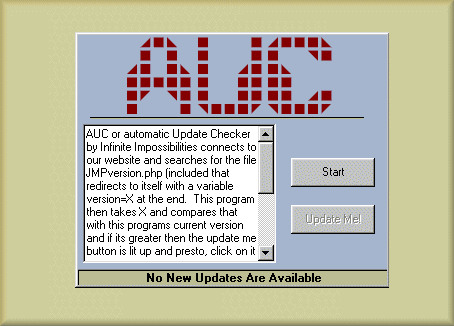



## Automatic Update Checker

### Description

This little guy will connect to a website and look for a (included) php file that tells the prog the version number currently released. From that we compare that with the users version number and if the users is lower then the update button is enabled where they can click to be brought to the download page (in a case of multiple new dependant downloads its not automatic). The internet link button was made by El Mariachi (http://planet-source-code.com/vb/scripts/ShowCode.asp?txtCodeId=9931&lngWId=1) so thanks. For more information on what it does see the code, its heavily commented.

--- Also, the down side... your website must be php enabled to use my included file, and the user should have an open internet connection obviously. Also the version number rather then using decimals is the major and minor numbers added so if your version number is 2.6 then the AUC compares 8 with whats on the website so when you adjust the page for your own version number, remember to add the first 2 numbers. (not the 3rd)
 
### More Info
 
Well... your website must be php enabled to use my included file, and the user should have an open internet connection obviously. Also the version number rather then using decimals is the major and minor numbers added so if your version number is 2.6 then the AUC compares 8 with whats on the website so when you adjust the page for your own version number, remember to add the first 2 numbers. (not the 3rd)

             |
---                |---
**Submitted On**   |2003-04-24 01:20:08
**By**             |[ChronicX](https://github.com/Planet-Source-Code/PSCIndex/blob/master/ByAuthor/chronicx.md)
**Level**          |Beginner
**User Rating**    |4.5 (18 globes from 4 users)
**Compatibility**  |VB 6\.0
**Category**       |[Miscellaneous](https://github.com/Planet-Source-Code/PSCIndex/blob/master/ByCategory/miscellaneous__1-1.md)
**World**          |[Visual Basic](https://github.com/Planet-Source-Code/PSCIndex/blob/master/ByWorld/visual-basic.md)
**Archive File**   |[Automatic\_1578664242003\.zip](https://github.com/Planet-Source-Code/chronicx-automatic-update-checker__1-44995/archive/master.zip)

